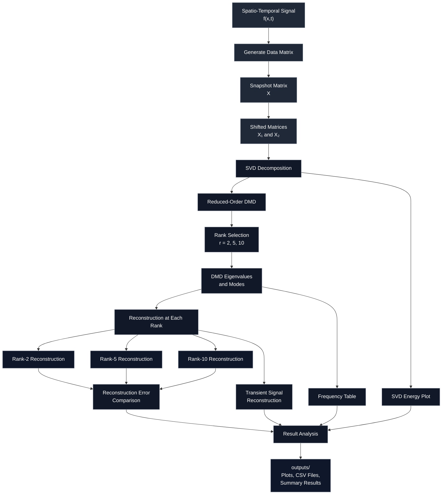
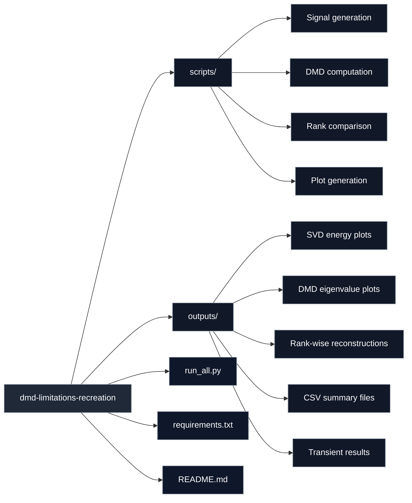

# Exploring the Limitations of Dynamic Mode Decomposition

This project recreates and analyzes important limitations of standard Dynamic Mode Decomposition (DMD). Instead of only showing where DMD performs well, this project focuses on cases where DMD can struggle: translating structures and transient behavior.

The goal is to understand when DMD gives a compact and accurate representation, and when it requires a higher rank or fails to capture time-localized dynamics.

---

## Problem Solved

Dynamic Mode Decomposition is commonly used to identify dominant spatial modes, frequencies, and reduced-order representations from time-dependent data.

However, standard DMD can struggle when the data contains:

* Moving or translating structures
* Rotating structures
* Short-lived transient events
* Patterns that appear only during part of the time window

This project studies these limitations using controlled spatio-temporal signals. It shows that a physically simple moving structure may require many DMD modes, and that transient behavior may not be captured well because standard DMD modes are global in time.

---

## Technical Overview

The project recreates a DMD limitation example using a complex-valued spatio-temporal signal:

$$
f(x,t) = f_1(x,t) + f_2(x,t)
$$

where

$$
f_1(x,t) = \operatorname{sech}(x + 6 - t)e^{i2.3t}
$$

and

$$
f_2(x,t) = 2\operatorname{sech}(x)\tanh(x)e^{i2.8t}
$$

The two angular frequencies are:

$$
\omega_1 = 2.3
$$

$$
\omega_2 = 2.8
$$

The first component, ( f_1(x,t) ), represents a translating structure. The second component, ( f_2(x,t) ), represents a stationary oscillatory structure.

Although the signal is mathematically simple, the translating part is difficult for standard DMD because the same shape appears at different spatial locations over time.

---

## Limitation 1 — Translation

A translating structure means that the same shape moves across space.

For example, a pulse moving from left to right is physically one simple object. However, to SVD-based methods, it may look like many different spatial patterns because the object appears at many different positions.

This causes DMD to require more modes than expected.

| DMD Rank | Expected Behavior                                                                    |
| -------: | ------------------------------------------------------------------------------------ |
|   Rank 2 | Too low; fails to reconstruct the translating structure well                         |
|   Rank 5 | Improves reconstruction, but still misses details                                    |
|  Rank 10 | Better reconstruction; shows that translation increases the required model dimension |

The key observation is:

> The system is physically simple, but DMD represents it with artificially high dimensionality.

---

## Limitation 2 — Transient Behavior

Transient behavior means that a structure appears only for a short time and then disappears.

Standard DMD assumes that each mode exists across the full time window. Because of this, it can struggle with on-off behavior.

For example, if a signal becomes active only during a limited time interval, DMD may spread that behavior across global modes instead of capturing the correct start and end time.

This motivates the use of methods such as multi-resolution DMD, which are better suited for time-localized dynamics.

---

## DMD Method

The signal is evaluated on a grid of spatial and temporal points.

The data matrix is arranged as:

$$
X = [x_1, x_2, x_3, \dots, x_m]
$$

where each column is one spatial snapshot at a particular time.

DMD then forms two shifted snapshot matrices:

$$
X_1 = [x_1, x_2, x_3, \dots, x_{m-1}]
$$

$$
X_2 = [x_2, x_3, x_4, \dots, x_m]
$$

DMD tries to find a linear operator ( A ) such that:

$$
X_2 \approx AX_1
$$

Instead of computing the full operator directly, the project uses reduced-order DMD through Singular Value Decomposition.

The reduced DMD operator is:

$$
\tilde{A} = U_r^* X_2 V_r \Sigma_r^{-1}
$$

The eigenvalues and modes of ( \tilde{A} ) are then used to reconstruct the system and estimate the dominant frequencies.

---

## Project Structure



---

## Repository Layout



---

## Folder Layout

```text
dmd-limitations-recreation/
│
├── scripts/
│   ├── recreate_article_equation.py
│   ├── dmd_utils.py
│   └── plotting_utils.py
│
├── outputs/
│   ├── rank_error_summary.csv
│   ├── svd_energy_table.csv
│   ├── 01_f_total_real.png
│   ├── 02_f_total_magnitude.png
│   ├── 03_svd_singular_values.png
│   ├── 04_svd_cumulative_energy.png
│   ├── rank_2/
│   ├── rank_5/
│   └── rank_10/
│
├── run_all.py
├── requirements.txt
└── README.md
```

---

## Setup

Create a virtual environment:

```bash
python -m venv .venv
```

Activate the environment.

For Windows PowerShell:

```powershell
.\.venv\Scripts\Activate.ps1
```

For Windows Command Prompt:

```cmd
.venv\Scripts\activate
```

For Mac or Linux:

```bash
source .venv/bin/activate
```

Install the required packages:

```bash
pip install -r requirements.txt
```

---

## Usage

Run the complete project:

```bash
python run_all.py
```

The script generates the spatio-temporal signal, applies DMD at different ranks, reconstructs the data, and saves plots and CSV files inside the `outputs/` folder.

---

## Outputs

| Output                               | Description                                        |
| ------------------------------------ | -------------------------------------------------- |
| `rank_error_summary.csv`             | Reconstruction error for each DMD rank             |
| `svd_energy_table.csv`               | Energy captured by each SVD mode                   |
| `01_f_total_real.png`                | Real part of the full signal                       |
| `02_f_total_magnitude.png`           | Magnitude of the full signal                       |
| `03_svd_singular_values.png`         | Singular value distribution                        |
| `04_svd_cumulative_energy.png`       | Cumulative SVD energy plot                         |
| `rank_2/`                            | Rank-2 DMD reconstruction results                  |
| `rank_5/`                            | Rank-5 DMD reconstruction results                  |
| `rank_10/`                           | Rank-10 DMD reconstruction results                 |
| `dmd_eigenvalues.png`                | DMD eigenvalues in the complex plane               |
| `dmd_mode_magnitudes.png`            | Spatial magnitude of DMD modes                     |
| `dmd_eigenvalue_frequency_table.csv` | Angular frequencies estimated from DMD eigenvalues |

---

## How to Interpret the Results

### Original Translating Signal

The original signal shows a spatial structure moving across the domain over time.

A human can interpret this as one pulse moving through space, but standard DMD may represent it using several modes.

---

### Rank-2 Reconstruction

Rank-2 DMD usually fails to reconstruct the translating structure accurately.

This shows that two modes are not enough, even though the signal contains only a small number of dominant frequencies.

---

### Rank-5 Reconstruction

Rank-5 reconstruction improves the result but may still miss some details of the moving structure.

This shows that increasing the rank helps, but the translation is still not represented efficiently.

---

### Rank-10 Reconstruction

Rank-10 reconstruction gives a better approximation of the translating signal.

This demonstrates the main limitation: translation can artificially increase the number of modes required by DMD.

---

### SVD Energy Plot

The SVD energy plot shows how much information is captured by each rank.

For translating structures, energy may be spread across multiple singular vectors instead of being concentrated in only one or two modes.

---

### Transient Reconstruction

The transient signal reconstruction shows how DMD struggles when a structure appears only during a limited time interval.

Because standard DMD modes exist globally in time, they may fail to capture the correct turn-on and turn-off behavior.

---

## Key Learning

This project shows that DMD is useful for extracting modes and frequencies, but it is not always efficient for moving or time-localized structures.

Main observations:

* Translating structures can require artificially high rank
* Low-rank DMD may fail even for physically simple systems
* SVD energy alone does not guarantee accurate DMD reconstruction
* Transient behavior is difficult for standard DMD
* These limitations motivate extensions such as multi-resolution DMD

---

## Technical Stack

* Python
* NumPy
* SciPy
* Matplotlib
* Dynamic Mode Decomposition
* Singular Value Decomposition
* Reduced-order modeling
* Scientific computing

---

## Interview Explanation

I reproduced a DMD limitations study to understand when standard Dynamic Mode Decomposition performs poorly. I tested translating and transient signals and compared reconstructions at different ranks. The main observation was that DMD can require artificially high rank for moving structures and may fail to capture on-off transient behavior. This motivated the use of multi-resolution DMD, which handles time-localized dynamics better.

---

## Summary

This project explores the limitations of standard DMD using controlled spatio-temporal signals. It shows that DMD is powerful for extracting modes and frequencies, but it can struggle when structures translate through space or appear only briefly in time.

The project is useful because it demonstrates not only how to apply DMD, but also how to critically evaluate when the method may fail.
